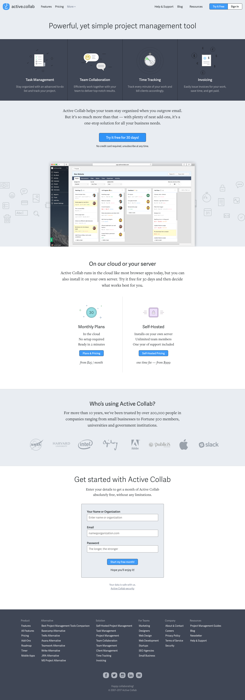

# activecollab Webpage Recreation

This project is an endeavor undertaken as a part of the BeCode curriculum. It involves the recreation of the Active Collaboration webpage using HTML and CSS.

The primary aim of this project is to gain hands-on experience in working with HTML and CSS. The recreated page is a faithful rendition of the original, making use of the concepts learnt during the course.

## Technologies

The technologies used in this project are:

- HTML5
- CSS3

 ## [Live](https://latteflo.github.io/activecollab/)

Original: 

